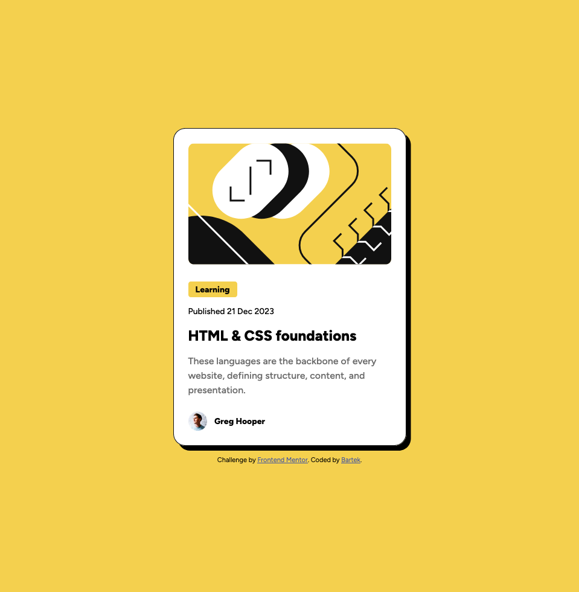

# Frontend Mentor - Blog preview card solution

This is a solution to the [Blog preview card challenge on Frontend Mentor](https://www.frontendmentor.io/challenges/blog-preview-card-ckPaj01IcS). Frontend Mentor challenges help you improve your coding skills by building realistic projects.

## Table of contents

- [Overview](#overview)
  - [Screenshot](#screenshot)
  - [Links](#links)
- [Author](#author)

## Overview

### Screenshot

### Links

- Solution URL: [Add solution URL here](https://github.com/bartekluczak/blog-preview-card)
- Live Site URL: [Add live site URL here](https://sage-moxie-9858c6.netlify.app/)

### Built with

- Semantic HTML5 markup
- CSS
- Flexbox
- Mobile-first workflow

## Author

- Website - [Bartek Łuczak](https://github.com/bartekluczak)
- Frontend Mentor - [@bartekluczak](https://www.frontendmentor.io/profile/bartekluczak)
